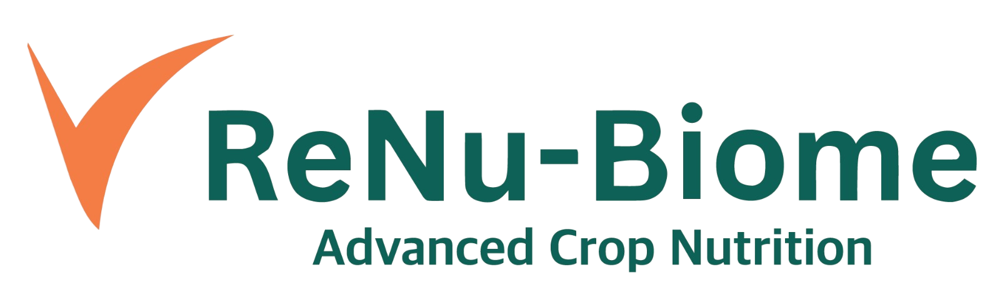

# 🌱 Renu Biome - Agricultural Management Platform

**Renu Biome** is a comprehensive agricultural management platform designed to streamline operations for agricultural businesses, growers, and agricultural product manufacturers. The platform provides tools for customer management, inventory tracking, sales analytics, and agricultural product innovation.



## 🚀 What is Renu Biome?

Renu Biome is a modern web application built for the agricultural industry that helps businesses manage their operations, track customer relationships, monitor inventory, and drive innovation in agricultural products. The platform serves two main user types:

- **Customers (Growers)**: Access to agricultural products, soil analysis, fertilizer recommendations, and appointment scheduling
- **Business Owners**: Complete business management including sales, inventory, employee management, and product development

## ✨ Key Features

### 🌾 Customer Dashboard
- **Soil Analysis & Recommendations**: Access to soil testing reports and personalized fertilizer recommendations
- **Product Catalog**: Browse and order agricultural products (Biome Care, K-Rush, Karanja Oil, Sirineem, SeaBioLife, SunSkreen)
- **Appointment Scheduling**: Book consultations with agricultural experts and founders
- **Legacy Programs**: Access to specialized crop nutrition programs
- **Invoice Management**: View, pay, and print bills
- **Field Visit Summaries**: Track field visits and recommendations

### 🏢 Business Owner Dashboard
- **Sales Analytics**: Comprehensive sales tracking and reporting with Chart.js integration
- **Inventory Management**: Track product stock levels and manage suppliers
- **Employee Management**: Manage team members and their roles
- **Financial Planning**: Budget planning and expense tracking
- **Product Innovation**: Pipeline management for new products and innovations
- **Compliance**: EPA and OMRI certification tracking
- **Retail Partnerships**: Manage relationships with major retailers (Walmart, Costco, Home Depot, Lowe's)
- **Patent Management**: Track intellectual property and patents
- **Trial Database**: Manage product testing and trials

## 🛠️ Technology Stack

- **Frontend**: Next.js 15 with React 19 (App Router)
- **Styling**: Tailwind CSS 4 with custom design system
- **UI Components**: Radix UI components for accessibility
- **Charts**: Chart.js and Recharts for data visualization
- **Authentication**: Supabase Auth with Next.js helpers
- **Database**: Supabase (PostgreSQL)
- **PDF Generation**: jsPDF for document creation
- **Icons**: Heroicons and Lucide React
- **TypeScript**: Full type safety throughout the application

## 🚀 Getting Started

### Prerequisites
- Node.js 18+ 
- npm, yarn, pnpm, or bun
- Supabase account (for backend services)

### Installation

1. **Clone the repository**
   ```bash
   git clone <your-repo-url>
   cd renu-biome
   ```

2. **Install dependencies**
   ```bash
   npm install
   # or
   yarn install
   # or
   pnpm install
   ```

3. **Set up environment variables**
   Create a `.env.local` file in the root directory:
   ```env
   NEXT_PUBLIC_SUPABASE_URL=your_supabase_url
   NEXT_PUBLIC_SUPABASE_ANON_KEY=your_supabase_anon_key
   SUPABASE_SERVICE_ROLE_KEY=your_service_role_key
   ```

4. **Run the development server**
   ```bash
   npm run dev
   # or
   yarn dev
   # or
   pnpm dev
   ```

5. **Open your browser**
   Navigate to [http://localhost:3000](http://localhost:3000)

## 📱 Available Scripts

- `npm run dev` - Start development server
- `npm run build` - Build for production
- `npm run start` - Start production server
- `npm run lint` - Run ESLint

## 🏗️ Project Structure

```
renu-biome/
├── src/
│   ├── app/                    # Next.js App Router
│   │   ├── dashboard/          # Main dashboard routes
│   │   │   ├── customer/       # Customer-specific features
│   │   │   └── owner/          # Business owner features
│   │   ├── login/              # Authentication
│   │   └── layout.tsx          # Root layout
│   ├── components/             # Reusable UI components
│   │   ├── ui/                 # Base UI components
│   │   └── Sidebar.tsx         # Navigation sidebar
│   └── lib/                    # Utility functions and API
│       ├── api/                # API endpoints
│       ├── supabaseClient.ts   # Supabase configuration
│       └── utils.ts            # Helper functions
├── public/                     # Static assets
└── tailwind.config.js          # Tailwind CSS configuration
```

## 🔐 Authentication

The platform uses Supabase for authentication with role-based access control:
- **Customer accounts**: Access to customer dashboard features
- **Owner accounts**: Full access to business management features

## 📊 Data Visualization

The platform includes comprehensive data visualization capabilities:
- **Sales Analytics**: Interactive charts for revenue tracking
- **Inventory Reports**: Stock level monitoring and trends
- **Customer Insights**: Relationship management analytics
- **Financial Dashboards**: Budget vs. actual tracking

## 🚀 Deployment

### Vercel (Recommended)
1. Connect your GitHub repository to Vercel
2. Set environment variables in Vercel dashboard
3. Deploy automatically on push to main branch

### Other Platforms
The application can be deployed to any platform that supports Next.js:
- Netlify
- Railway
- DigitalOcean App Platform
- AWS Amplify

## 🤝 Contributing

1. Fork the repository
2. Create a feature branch (`git checkout -b feature/amazing-feature`)
3. Commit your changes (`git commit -m 'Add amazing feature'`)
4. Push to the branch (`git push origin feature/amazing-feature`)
5. Open a Pull Request

## 📄 License

This project is proprietary software. All rights reserved.

## 🆘 Support

For support and questions:
- Create an issue in the GitHub repository
- Contact the development team
- Check the documentation in the dashboard

## 🔮 Roadmap

- **Mobile App**: Native iOS and Android applications
- **AI Integration**: Machine learning for crop recommendations
- **IoT Integration**: Sensor data integration for precision agriculture
- **Marketplace**: Direct-to-consumer product sales
- **Analytics**: Advanced business intelligence and reporting

---

**Built with ❤️ for the agricultural community**
